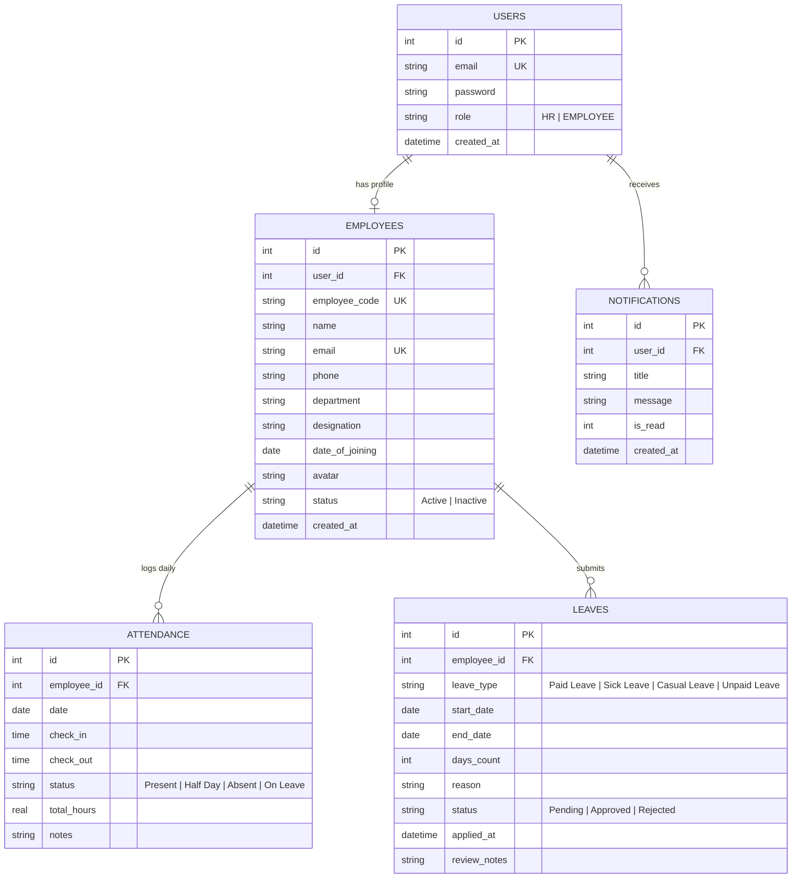

# Database Schema & Entity-Relationship (ER) Diagram

This document details the relational database schema for the **Human Resource Management System (HRMS)**. The system uses **SQLite** with foreign key constraints enabled for data integrity.

---

## Entity-Relationship (ER) Diagram

---

## Detailed Table Definitions

### 1. `users` Table
Stores authentication credentials and high-level role authorization.
- `id` (INTEGER, PK, AUTOINCREMENT): Unique identifier.
- `email` (TEXT, UNIQUE, NOT NULL): Account login email address.
- `password` (TEXT, NOT NULL): `bcrypt` salted hash of password.
- `role` (TEXT, NOT NULL): Role designation (`HR` or `EMPLOYEE`).
- `created_at` (DATETIME): Timestamp of account creation.

### 2. `employees` Table
Stores detailed personal and professional profile details.
- `id` (INTEGER, PK, AUTOINCREMENT): Unique employee ID.
- `user_id` (INTEGER, UNIQUE, FK -> `users.id` ON DELETE CASCADE): Linked user login account.
- `employee_code` (TEXT, UNIQUE, NOT NULL): Company code (e.g. `EMP-1001`, `EMP-HR001`).
- `name` (TEXT, NOT NULL): Full legal name.
- `email` (TEXT, UNIQUE, NOT NULL): Work email address.
- `phone` (TEXT, NOT NULL): Contact phone number.
- `department` (TEXT, NOT NULL): Assigned department (e.g. Engineering, HR, Product).
- `designation` (TEXT, NOT NULL): Job position title.
- `date_of_joining` (DATE, NOT NULL): Official date of joining.
- `avatar` (TEXT): Base64 or image URL.
- `status` (TEXT): Employment status (`Active` / `Inactive`).

### 3. `attendance` Table
Tracks daily check-in, check-out, and total hours worked.
- `id` (INTEGER, PK, AUTOINCREMENT): Unique record ID.
- `employee_id` (INTEGER, FK -> `employees.id` ON DELETE CASCADE): Employee reference.
- `date` (DATE, NOT NULL): Date of record (`YYYY-MM-DD`).
- `check_in` (TIME): Clock in timestamp (`HH:MM:SS`).
- `check_out` (TIME): Clock out timestamp (`HH:MM:SS`).
- `status` (TEXT): Attendance state (`Present`, `Half Day`, `Absent`, `On Leave`).
- `total_hours` (REAL): Calculated work duration in decimal hours.
- `notes` (TEXT): Additional context or leave notes.
- *Constraint*: `UNIQUE(employee_id, date)` ensures one attendance record per employee per day.

### 4. `leaves` Table
Manages leave applications and HR approval lifecycle.
- `id` (INTEGER, PK, AUTOINCREMENT): Unique leave ID.
- `employee_id` (INTEGER, FK -> `employees.id` ON DELETE CASCADE): Applicant employee.
- `leave_type` (TEXT, NOT NULL): Category (`Paid Leave`, `Sick Leave`, `Casual Leave`, `Unpaid Leave`).
- `start_date` (DATE, NOT NULL): Beginning date of leave.
- `end_date` (DATE, NOT NULL): Return date of leave.
- `days_count` (INTEGER, NOT NULL): Total days requested.
- `reason` (TEXT, NOT NULL): Justification for leave.
- `status` (TEXT, DEFAULT 'Pending'): Status (`Pending`, `Approved`, `Rejected`).
- `applied_at` (DATETIME): Application timestamp.
- `review_notes` (TEXT): Optional feedback or reason from HR.

### 5. `notifications` Table
In-app messaging feed for employee updates.
- `id` (INTEGER, PK, AUTOINCREMENT): Notification ID.
- `user_id` (INTEGER, FK -> `users.id` ON DELETE CASCADE): Recipient account.
- `title` (TEXT, NOT NULL): Subject title.
- `message` (TEXT, NOT NULL): Notification body.
- `is_read` (INTEGER, DEFAULT 0): Read flag (0 for unread, 1 for read).
- `created_at` (DATETIME): Creation timestamp.
